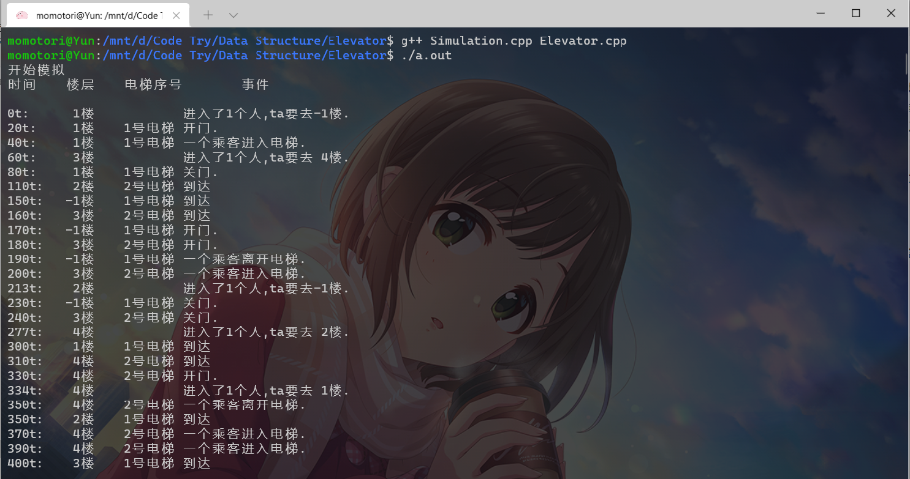
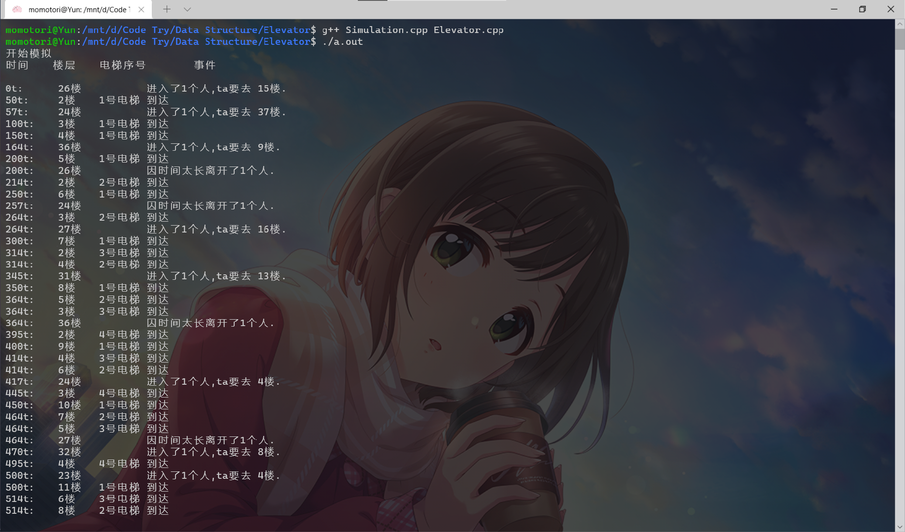

<div align='center' ><font size='6'><b>电梯模拟报告</b></font></div>


<!-- @import "[TOC]" {cmd="toc" depthFrom=1 depthTo=6 orderedList=false} -->

<!-- code_chunk_output -->

- [实验要求](#实验要求)
- [设计思路](#设计思路)
- [关键代码讲解](#关键代码讲解)
  - [头文件](#头文件)
  - [实现代码](#实现代码)
    - [Evt类方法](#evt类方法)
    - [State类方法](#state类方法)
      - [PIF](#pif)
      - [EvaMove](#evamove)
      - [EvaMoveDone](#evamovedone)
      - [FBIOpenTheDoor](#fbiopenthedoor)
      - [IOEva](#ioeva)
      - [CloseDoor](#closedoor)
      - [HomeSweetHome](#homesweethome)
      - [CallEva](#calleva)
      - [RushB](#rushb)
- [调试分析](#调试分析)
    - [时空复杂度](#时空复杂度)
    - [问题](#问题)
      - [类内函数传参问题](#类内函数传参问题)
      - [编码问题](#编码问题)
- [代码测试](#代码测试)
- [实验总结](#实验总结)
- [附录](#附录)

<!-- /code_chunk_output -->


## 实验要求

（1）模拟某校五层教学楼的电梯系统。该楼有一个自动电梯，能在每层停留。五个楼层由下至上依次称为地下层、第一层、第二层、第三层和第四层，其中第一层是大楼的进出层，即是电梯的“本垒层”，电梯“空闲”时，将来到该层候命。
  
（2）乘客可随机地进出于任何层。对每个人来说，他有一个能容忍的最长等待时间，一旦等候电梯时间过长，他将放弃。
  
（3）模拟时钟从0开始，时间单位为0.1秒。人和电梯的各种动作均要耗费一定的时间单位（简记为t），比如：

    有人进出时，电梯每隔40t测试一次，若无人进出，则关门；

    关门和开门各需要20t；

    每个人进出电梯均需要25t；

    如果电梯在某层静止时间超过300t，则驶回1层候命。
  
（4）按时序显示系统状态的变化过程：发生的全部人和电梯的动作序列。

## 设计思路

`Simulation.h`:

先利用结构体定义乘客和电梯的结构作为一个动作发生的客观主体，同时也是输出结果的主要主体，在源文件中分别定义为`people`和`elevator`，其中`people`的结构是乘客链表的基本单元

其次是当前状态类`State`，记录当前上下楼按钮标记，乘客的链表结构，以及电梯数组（方便乱序调用电梯），并在方法处定义一系列改变状态的函数

最后定义事件结构体`event`，并使用线性链表类`Evt`按照时间发生顺序排列事件，并定义根据时间顺序插入事件、触发事件、查询事件存在等方法

同时在`State`和`Evt`两个类中留有彼此的指针进行“绑定”，在`Sim`类初始化时对指针进行绑定

总结一下就是`Sim`类包含一对`State`和`Evt`类，其中`Evt`类是事件的触发器，根据事件函数调用`State`类的公共接口来改变`State`类的状态

其中电梯运作时所需要的每个常数都是用const int类变量储存，可以方便地进行更改，包括楼层数量与电梯数量

## 关键代码讲解

### 头文件

首先是头文件的声明，每个变量和函数的含义已经用注释标明

```cpp
const int FLOOR = 5;
const int ElevatorNumber = 2;        //电梯数
const int T_Into_F = 200;            //乘客进楼时间间隔上限
const int EWT = 300;                //电梯等待时间
const int WaitingTime = 200;        //乘客等待时间
const int PIOE = 20;                 //乘客进出电梯时间
const int MovingT = 50;              //电梯移动一楼所用时间
const int Doortime = 20;             //开关门时间
const int CloseDoorWaitingtime = 30; //关门测试时间
const int FinishTime = 10000;        //测试结束时间
struct people
{
    int target;     //目标楼层
    int giveuptime; //放弃时间
    people *next;   //链表->队列
};
struct elevator
{
    enum state
    {
        Stop,
        Up,
        Down
    } S; //电梯状态
    int floor;
    people *passenger; //搭载乘客，按照最近的目标楼层排序
    int targetfloor;   //电梯前往的目标楼层，乘客前往的最近的targetfloor
    bool IFDO;         //是否开门，判断是否停靠
    bool IfIO;         //开门后是否有人进出电梯
    elevator()
    {
        S = Stop;
        floor = 1;
        passenger = NULL;
        targetfloor = 1;
        IFDO = 0;
        IfIO = 0;
    }
};
class State
{
private:
    bool Callup[FLOOR];   //人的上楼标记
    bool Calldown[FLOOR]; //人的下楼标记
    people PInF[FLOOR];   //People in Floor,各楼的人的头链表，按照放弃时间排序
    elevator *E;          //电梯
    Evt *e;               //事件连接

public:
    State(Evt *p);
    void EvaMove(int n, elevator::state flag);     //电梯移动命令，对第n个电梯下达上楼或下楼的命令,n>=0
    void EvaMoveDone(int);                         //事件函数，移动结束事件
    void CallEva(int floor, elevator::state flag); //呼叫电梯命令，发起电梯调配
    void FBIOpenTheDoor(int);                      //电梯开门及之后的事件处理
    void IOEva(int);                               //乘客进出电梯，先出后进
    void CloseDoor(int);                           //关闭电梯，寻找下一个target楼层，执行EvaMove.
    void HomeSweetHome(int);                       //电梯开始返回本垒层
    void PIF(int);                                 //事件函数，People Into Floor乘客进楼事件
    void RushB(int);                               //事件函数，判断有没有人等不及润了
};

struct event
{
    int time;                   //事件发生时间
    event *next;                //组成事件链表

    /* 事件的动作函数，并可用于标识事件类型若函数
    无参数则使用默认参数吸收保证形式相同 */
    void (State::*Finish)(int); 
    
    int n;                      //保存传入参数
    event(int t, void (State::*p)(int))
    {
        time = t;
        next = NULL;
        Finish = p;
    }
};
class Evt
{
private:
    event Head; //按时间排序的事件链表头结点
    State *s;   //绑定State
public:
    Evt(State *a) : Head(event(0, NULL)) { s = a; }
    void AddEvt(int t, void (State::*foo)(int), int n = 0);
    void EvtHappen();
    bool EvtTraverse(void (State::*foo)(int), int i = -1); //遍历是否有foo对应事件,若有返回1
    void EvtDelete(void (State::*foo)(int), int i = -1);   //删除触发函数为foo的第一个事件.
    int time() { return Head.time; }
};
```

### 实现代码

#### Evt类方法

先从`Evt`类的主要方法开始说明

所有方法都利用指向“类成员函数名”的指针来传递参数，并且可以多传递两个int类型参数，一个用于指示事件发生的时间，另一个参数是调用函数的参数，将这些信息全部保存在事件单元`event`中，这就是`AddEvt`的实现

```cpp
void Evt::AddEvt(int t, void (State::*foo)(int), int n) //添加事件
{
    event *temp = new event(t, foo), *pt = &Head;
    while (pt->next && temp->time > pt->next->time)
        pt = pt->next;
    temp->next = pt->next;
    pt->next = temp;
    temp->n = n;
}
```

而事件发生则直接选择链表头部所指的第一个单元，将当前时间更新为时间事件（链表头部空闲单元的时间存储当前时间），并将其所存储函数解引用并调用，函数结束后删除该单元

```cpp
void Evt::EvtHappen()
{
    auto temp = Head.next;
    Head.time = temp->time;//将当前事件更新为时间事件
    Head.next = temp->next;
    (s->*(temp->Finish))(temp->n); //调用对应的函数，注意函数定义在State类对象s中
    delete temp;
}
```

#### State类方法

这个板块主要说明改变State状态的函数也就是State类所声明的各个方法的实现

##### PIF

`State::PIF(int)`为乘客进入楼层的事件，结构为：

1. 在`Evt`类中加入下一个人进入楼层`State::PIF(int)`的事件
2. 输出乘客进入楼层的信息
3. 建立人链表节点
4. 判断人所前往楼层方向的按钮是否按下，若否，则标记按钮为`true`，并调用`void State::CallEva(int floor, elevator::state flag)`函数呼叫电梯，`CallEva`实现看[这里](#calleva)
5. 检查乘客所进入楼层是否已经有乘客想要离开的事件，若有，则不需要新增离开事件`RushB`

```cpp
void State::PIF(int i = 0)
{
    e->AddEvt(e->time() + rand() % T_Into_F + 1, &State::PIF); 
    //下一个人进入事件加入事件表，其中加1牺牲一个时间精度消除同时有人进楼的可能
    int floor = rand() % FLOOR;
    int target;
    while ((target = rand() % FLOOR) == floor)
        ; //target!=floor

    //下面是信息输出
    if (floor)
        std::cout << e->time() << "t:\t " << floor << "楼\t\t进入了1个人,ta要去";
    else
        std::cout << e->time() << "t:\t"
                  << "-1楼\t\t进入了1个人,ta要去";
    if (target)
        std::cout << " " << target << "楼.\n";
    else
        std::cout << "-1楼.\n";

    auto temp = PInF + floor;
    while (temp->next)
        temp = temp->next;
    temp = temp->next = new people();
    temp->next = NULL;
    temp->target = target;
    temp->giveuptime = e->time() + WaitingTime; //人链表节点建立完成

    if (target > floor && !Callup[floor]) //上楼且未按按钮
    {
        for (i = 0; i < ElevatorNumber; i++)
        {
            if (E[i].floor == floor && E[i].S == elevator::Up)
                break;
        }
        if (i == ElevatorNumber)
        {
            Callup[floor] = 1;
            CallEva(floor, elevator::Up);
        }
    }
    else if (target < floor && !Calldown[floor])
    {
        for (i = 0; i < ElevatorNumber; i++)
        {
            if (E[i].floor == floor && E[i].S == elevator::Down)
                break;
        }
        if (i == ElevatorNumber)
        {
            Calldown[floor] = 1;
            CallEva(floor, elevator::Down);
        }
    }
    if (!e->EvtTraverse(&State::RushB, floor)) //第n层楼没有人想离开，即这是第一个人
        e->AddEvt(temp->giveuptime, &State::RushB, floor);
}
```

##### EvaMove

这是设置电梯移动上下一楼，以及添加电梯移动结束事件的函数，输入第eva个电梯和上楼还是下楼的标志

```cpp
void State::EvaMove(int eva, elevator::state flag)
{
    //在此时便改变电梯楼层
    if (!e->EvtTraverse(&State::EvaMoveDone, eva) && !E[eva].IfIO) //n号电梯没有移动&&未开门
    {
        if (flag == elevator::Up)
            E[eva].floor++;
        if (flag == elevator::Down)
            E[eva].floor--;
        e->AddEvt(e->time() + MovingT, &State::EvaMoveDone, eva);
    }
}
```

##### EvaMoveDone

电梯移动结束的函数，输入第eva个电梯

```cpp
void State::EvaMoveDone(int eva)
{
    if (E[eva].floor > 0)
        std::cout << e->time() << "t:\t " << E[eva].floor << "楼\t" << eva + 1 
        << "号电梯\t到达\n";
    else
        std::cout << e->time() << "t:\t"
                  << "-1楼\t" << eva + 1 << "号电梯\t到达\n";

    //若有电梯停止事件则触发停止事件：先判断到达指定楼层，然后判断该层有同方向call
    if ((E[eva].floor == E[eva].targetfloor) || //电梯到达目标楼层
    (E[eva].S == elevator::Up && Callup[E[eva].floor]) || //有同是上楼的呼叫
    (E[eva].S == elevator::Down && Calldown[E[eva].floor]))
    {
        //开门
        E[eva].IFDO = 1;
        e->AddEvt(e->time() + Doortime, &State::FBIOpenTheDoor, eva);
    }
    else
        EvaMove(eva, E[eva].S);//继续移动
}
```

##### FBIOpenTheDoor

第eva个电梯开门，并在开门的同时设置下一个target楼层

```cpp
void State::FBIOpenTheDoor(int eva)
{
    //电梯内已经达到电梯内乘客最近的目标楼层，则按照调度的规则安排新的目标楼层
    if (E[eva].S != elevator::Stop && E[eva].targetfloor == E[eva].floor)
    {
        people *temp = E[eva].passenger;
        while (temp && temp->target == E[eva].targetfloor)
            temp = temp->next;
        if (temp)
        {
            /* 电梯内还有乘客，则直接按照电梯内乘客的target楼层安排 */
            E[eva].targetfloor = temp->target;
        }
        //调度算法
        else if (((E[eva].S == elevator::Up && Callup[E[eva].floor]) || 
        (E[eva].S == elevator::Down && Calldown[E[eva].floor])))
        {
            /* 电梯存在对应方向的楼层的call，将其清零 */
            if (E[eva].S == elevator::Up)
                Callup[E[eva].floor] = 0;
            else if (E[eva].S == elevator::Down)
                Calldown[E[eva].floor] = 0;
        }
        else if ((E[eva].S == elevator::Up && Calldown[E[eva].floor]) ||
         (E[eva].S == elevator::Down && Callup[E[eva].floor]))
        {/* 该楼层有反方向的call，则判断正方向的剩余楼层是否
        还有call的需要，若无则响应这个反方向的call */
            if (E[eva].S == elevator::Up)
            {
                int i;
                for (i = E[eva].floor + 1; i < FLOOR; i++)
                {
                    if (Callup[i])
                    {
                        E[eva].targetfloor = i;
                        break;
                    }
                    if (Calldown[i])
                        E[eva].targetfloor = i;
                }
                if (E[eva].targetfloor == E[eva].floor)
                {
                    E[eva].S = elevator::Down;
                    Calldown[E[eva].floor] = 0;
                }
            }
            else if (E[eva].S == elevator::Down)
            {
                int i;
                for (i = E[eva].floor - 1; i >= 0; i--)
                {
                    if (Calldown[i])
                    {
                        E[eva].targetfloor = i;
                        break;
                    }
                    if (Callup[i])
                        E[eva].targetfloor = i;
                }
                if (E[eva].targetfloor == E[eva].floor)
                {
                    E[eva].S = elevator::Up;
                    Callup[E[eva].floor] = 0;
                }
            }
        }
        else
        {/* 不仅判断正方向，更判断一遍反方向剩余楼层，即将所有楼层的呼叫进行响应 */
            if (E[eva].S == elevator::Up)
            {
                int i;
                for (i = E[eva].floor + 1; i < FLOOR; i++)
                {
                    if (Callup[i])
                    {
                        E[eva].targetfloor = i;
                        break;
                    }
                    if (Calldown[i])
                        E[eva].targetfloor = i;
                }
                if (E[eva].targetfloor == E[eva].floor)
                {
                    for (i = E[eva].floor - 1; i >= 0; i--)
                    {
                        if (Calldown[i])
                        {
                            E[eva].targetfloor = i;
                            break;
                        }
                        if (Callup[i])
                            E[eva].targetfloor = i;
                    }
                }
            }
            else if (E[eva].S == elevator::Down)
            {
                int i;
                for (i = E[eva].floor - 1; i >= 0; i--)
                {
                    if (Calldown[i])
                    {
                        E[eva].targetfloor = i;
                        break;
                    }
                    if (Callup[i])
                        E[eva].targetfloor = i;
                }
                if (E[eva].targetfloor == E[eva].floor)
                    for (i = E[eva].floor + 1; i < FLOOR; i++)
                    {
                        if (Callup[i])
                        {
                            E[eva].targetfloor = i;
                            break;
                        }
                        if (Calldown[i])
                            E[eva].targetfloor = i;
                    }
            }
            if (E[eva].targetfloor == E[eva].floor)
            {
                /* 如所有楼层均无响应，改变电梯为Stop状态，并添加一段时间后返回本垒层事件 */
                E[eva].S = elevator::Stop;
                e->AddEvt(e->time() + EWT, &State::HomeSweetHome, eva);
            }
            else if (E[eva].targetfloor > E[eva].floor)//上楼
                E[eva].S = elevator::Up;
            else if (E[eva].targetfloor < E[eva].floor)//下楼
                E[eva].S = elevator::Down;
            if (!E[eva].passenger)
            {//电梯没人且该层没有楼层呼叫CallUp或CallDown
                if (E[eva].targetfloor > E[eva].floor)
                {
                    EvaMove(eva, elevator::Up);
                    return; //不需要安排开门事件
                }
                else if (E[eva].targetfloor < E[eva].floor)
                {
                    EvaMove(eva, elevator::Down);
                    return; //不需要安排开门事件
                }
            }
        }
    }
    if (E[eva].floor)
        std::cout << e->time() << "t:\t " << E[eva].floor << "楼\t" << eva + 1 
        << "号电梯\t开门.\n";
    else
        std::cout << e->time() << "t:\t-1楼\t" << eva + 1 << "号电梯\t开门.\n";
    /* 电梯开门时间 */
    e->AddEvt(e->time() + PIOE, &State::IOEva, eva);
    /* 判断电梯是否进出人来关门的函数 */
    e->AddEvt(e->time() + CloseDoorWaitingtime, &State::CloseDoor, eva);
}
```

##### IOEva

乘客进出电梯的事件

```cpp
/* 一次函数触发一个乘客的进出事件 */
void State::IOEva(int eva)
{
    //根据电梯状态进人
    people *temp, *p;
    if (E[eva].passenger && (E[eva].passenger->target == E[eva].floor))
    { //乘客出门判断
        temp = E[eva].passenger;
        E[eva].passenger = temp->next;
        delete temp;
        e->AddEvt(e->time() + PIOE, &State::IOEva, eva);
        E[eva].IfIO = 1;

        if (E[eva].floor)
            std::cout << e->time() << "t:\t " << E[eva].floor << "楼\t" << eva + 1 
            << "号电梯\t一个乘客离开电梯.\n";
        else
            std::cout << e->time() << "t:\t-1楼\t" << eva + 1 << "号电梯\t一个乘客离开电梯.\n";
    }
    else
    { //乘客进门判断
        temp = (PInF + E[eva].floor);//楼层乘客链表的头部
        if (E[eva].S == elevator::Up)
            while (temp->next && temp->next->target < E[eva].floor)
                temp = temp->next;
        if (E[eva].S == elevator::Down)
            while (temp->next && temp->next->target > E[eva].floor)
                temp = temp->next;
        if (temp->next)
        {
            p = temp->next;
            temp->next = p->next;
            temp = E[eva].passenger;
            if (E[eva].S == elevator::Up)
            {
                if (E[eva].passenger && p->target >= E[eva].passenger->target)
                {
                    while (temp->next && p->target > temp->next->target)
                        temp = temp->next;
                    p->next = temp->next;
                    temp->next = p;
                }
                else
                {
                    E[eva].passenger = p;
                    p->next = temp;
                }
            }
            if (E[eva].S == elevator::Down)
            {
                if (E[eva].passenger && p->target <= E[eva].passenger->target)
                {
                    while (temp->next && p->target < temp->next->target)
                        temp = temp->next;
                    p->next = temp->next;
                    temp->next = p;
                }
                else
                {
                    E[eva].passenger = p;
                    p->next = temp;
                }
            }
            e->AddEvt(e->time() + PIOE, &State::IOEva, eva);
            E[eva].IfIO = 1;
            if (E[eva].floor)
                std::cout << e->time() << "t:\t " << E[eva].floor << "楼\t" << eva + 1 
                << "号电梯\t一个乘客进入电梯.\n";
            else
                std::cout << e->time() << "t:\t-1楼\t" << eva + 1 
                << "号电梯\t一个乘客进入电梯.\n";
        }
        else
        {
            if (E[eva].S == elevator::Up)
                Callup[E[eva].floor] = 0;
            if (E[eva].S == elevator::Down)
                Calldown[E[eva].floor] = 0;
        }
    }
}
```

##### CloseDoor

判断电梯是否能够关门，并做出对应的动作

```cpp
void State::CloseDoor(int eva)
{
    //若已达到电梯target，则判断其新的target
    //若无则根据target设置下一个move
    //若无下一个move改变电梯状态为停止，并设置电梯返回本垒层事件
    if (E[eva].IfIO)
    {
        /* 有人进出，电梯不能关门 */
        E[eva].IfIO = 0;
        e->AddEvt(e->time() + CloseDoorWaitingtime, &State::CloseDoor, eva); //设置下一次检查
        return;
    }
    else if (E[eva].IFDO)
    {
        /* 电梯没有人进出，关门 */
        e->AddEvt(e->time() + Doortime, &State::CloseDoor, eva); //设置关门完成事件
        E[eva].IFDO = 0;
        if (E[eva].floor)
            std::cout << e->time() << "t:\t " << E[eva].floor << "楼\t" << eva + 1 
            << "号电梯\t关门.\n";
        else
            std::cout << e->time() << "t:\t-1楼\t" << eva + 1 << "号电梯\t关门.\n";
        return;
    }
    else
    {
        /* 已关门，准备移动 */
        if (E[eva].passenger)
            E[eva].targetfloor = E[eva].passenger->target;
        if (E[eva].targetfloor > E[eva].floor)
        {
            E[eva].S = elevator::Up;
            if (Callup[E[eva].floor]) //若当楼call有同方向则再次呼叫FBIOpenTheDoor
            {
                Callup[E[eva].floor] = 0;
                e->AddEvt(e->time() + Doortime, &State::FBIOpenTheDoor, eva);
            }
            else
                EvaMove(eva, elevator::Up);
        }
        else if (E[eva].targetfloor < E[eva].floor)
        {
            E[eva].S = elevator::Down;
            if (Calldown[E[eva].floor])
            {
                Calldown[E[eva].floor] = 0;
                e->AddEvt(e->time() + Doortime, &State::FBIOpenTheDoor, eva);
            }
            else
                EvaMove(eva, elevator::Down);
        }
        else
        {
            E[eva].S = elevator::Stop;
            if (e->EvtTraverse(&State::HomeSweetHome, eva))
                e->AddEvt(e->time() + EWT, &State::HomeSweetHome, eva);
        }
    }
}
```

##### HomeSweetHome

输入整数eva，第eva个电梯等待一段时间后返回本垒层

```cpp
void State::HomeSweetHome(int eva)
{
    E[eva].targetfloor = 1;
    if (E[eva].floor > 1)
    {
        E[eva].S = elevator::Down;
        EvaMove(eva, elevator::Down);
    }
    else if (E[eva].floor < 1)
    {
        E[eva].S = elevator::Up;
        EvaMove(eva, elevator::Up);
    }
}
```

##### CallEva

输入呼叫的楼层和上楼还是下楼的标志，按照输入改变电梯状态

```cpp
//根据呼叫楼层和上下楼标识呼叫电梯
void State::CallEva(int floor, elevator::state flag) 
{
    //若存在电梯现楼层到target楼层有呼叫楼层，则不做任何动作，此电梯在路上会开门
    //若有停止电梯，选择距离最近的，改变其target为该层，即调用此电梯
    //若无则所有电梯皆繁忙，不做任何动作
    int stopE = -1, i = 0, min;
    while (i < ElevatorNumber)
    {
        if (E[i].S == flag && (E[i].floor - floor) * (floor - E[i].targetfloor) >= 0)
            return;
        if (E[i].S == elevator::Stop)
            if (stopE == -1)
            {
                stopE = i;
                min = (E[i].floor - floor) * (E[i].floor - floor); //取正数
            }
            else if ((E[i].floor - floor) * (E[i].floor - floor) < min)
            {
                stopE = i;
                min = (E[i].floor - floor) * (E[i].floor - floor);
            }
        i++;
    }
    if (stopE != -1)
    {
        if (floor > E[stopE].floor)//上楼
        {
            E[stopE].S = elevator::Up;
            E[stopE].targetfloor = floor;
            EvaMove(stopE, elevator::Up);
        }
        else if (floor < E[stopE].floor)//下楼
        {
            E[stopE].S = elevator::Down;
            E[stopE].targetfloor = floor;
            EvaMove(stopE, elevator::Down);
        }
        else if (floor == E[stopE].floor)//同楼，开门
        {
            E[stopE].IFDO = 1;
            E[stopE].S = flag;
            e->AddEvt(e->time() + Doortime, &State::FBIOpenTheDoor, stopE);
        }
        e->EvtDelete(&State::HomeSweetHome, stopE);//若调用电梯，则删除返回本垒层事件
    }
}
```

##### RushB

等待时间过长，乘客离开

```cpp
void State::RushB(int floor)
{
    if (PInF[floor].next && e->time() == PInF[floor].next->giveuptime) 
    //存在要放弃的人仍然未进入电梯
    {
        auto temp = (PInF + floor)->next;
        PInF[floor].next = temp->next;
        delete temp;
        if (floor)
            std::cout << e->time() << "t:\t " << floor << "楼\t\t因时间太长离开了1个人.\n";
        else
            std::cout << e->time() << "t:\t"
                      << "-1楼\t\t因时间太长离开了1个人.\n";
    }
    if (PInF[floor].next)
        e->AddEvt(PInF[floor].next->giveuptime, &State::RushB, floor);
}
```

## 调试分析

#### 时空复杂度

主要分析事件链表结构的时空复杂度

||时间|空间|
|-|-|-|
|AddEvt|O(n)|O(1)|
|EvtHappen|取决于调用函数|取决于调用函数|
|EvtTraverse|O(n)|O(1)|
|EvtDelete|O(n)|O(1)|

#### 问题

##### 类内函数传参问题

一开始对于传递函数是直接使用原本的函数名作为参数来传递，但这样就会出现报错

```Bash
error: invalid use of non-static member function
```

这是因为ISOCPP的标准禁止将非static的类成员函数作为参数传递

最简单的解决方法就是使用&与->\*或.\*结构，使用`&`创建一个指向“类成员函数指针”的指针，然后在调用函数时使用`类指针->*p(/* args */)`或`类对象.*p(/* args */)`进行解引用即可（注意：解引用后为函数符，仍然需要后面加上括号和参数进行调用）

同时需要注意语法，虽然调用是在`State`类中，但是不能直接将参数写为`&func`，而是应该写成`&State::func`

##### 编码问题

因为程序使用了中文输出，在编译运行时需注意命令行的中文编码格式，否则将会造成输出异常

## 代码测试

双梯运行结果如下



若将参数改为floor=40,ElevatorNumber=4,则得到下面的输出




## 实验总结

本次实验是笔者第一次尝试cpp的较大型的项目，按照一定的设计思路，设计不同的类，并将其进行封装，保留公有接口

不足的是在调试过程中没有很好的利用共有接口进行调试，而是按照老方法不断运行直到错误发生，这是需要反思的点

不过学习到了关于类内函数传参问题的解决方法，并额外拓展了相关问题，并整理了[相关资料](http://home.ustc.edu.cn/~taoyang_2002/blog/public/posts/pointers-to-members/)

## 附录

.  
├── Elevator.cpp  
├── Simulation.cpp  
└── Simulation.h

文件树如上，Elevator.cpp是调用函数的main函数，Simulation.h和Simulation.cpp分别是各个函数的声明和实现