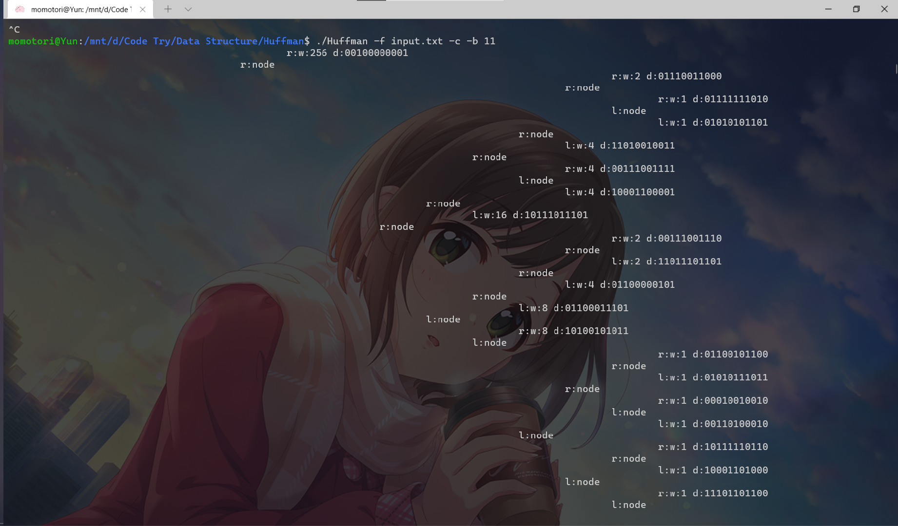
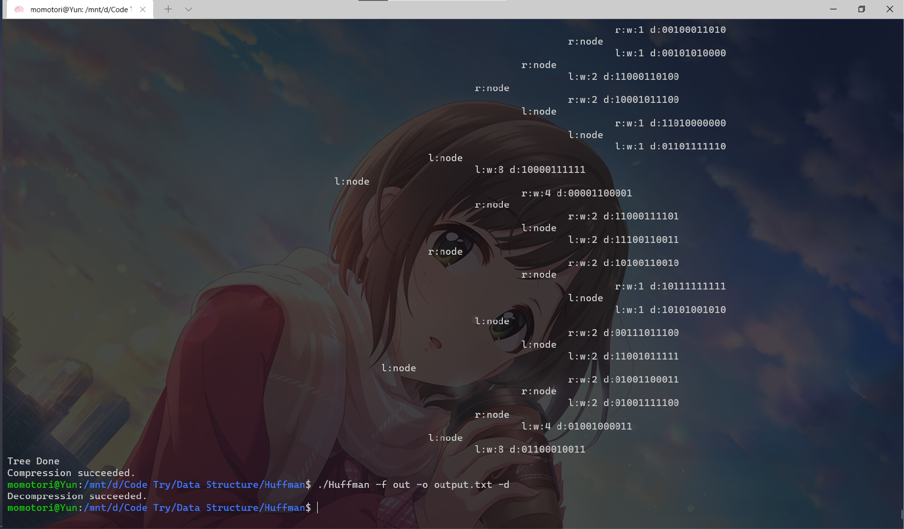
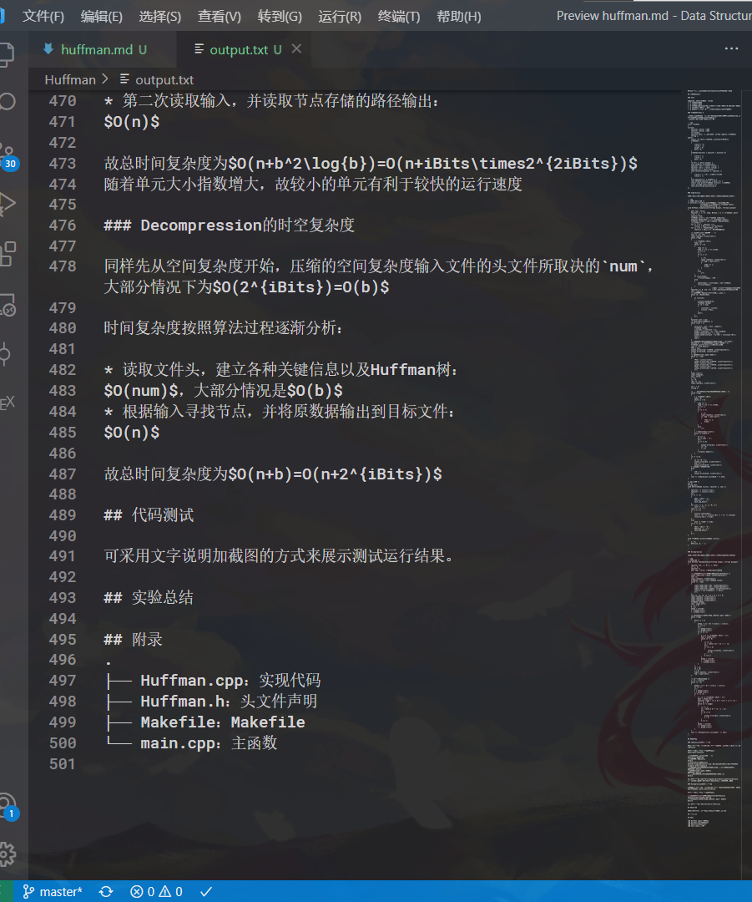
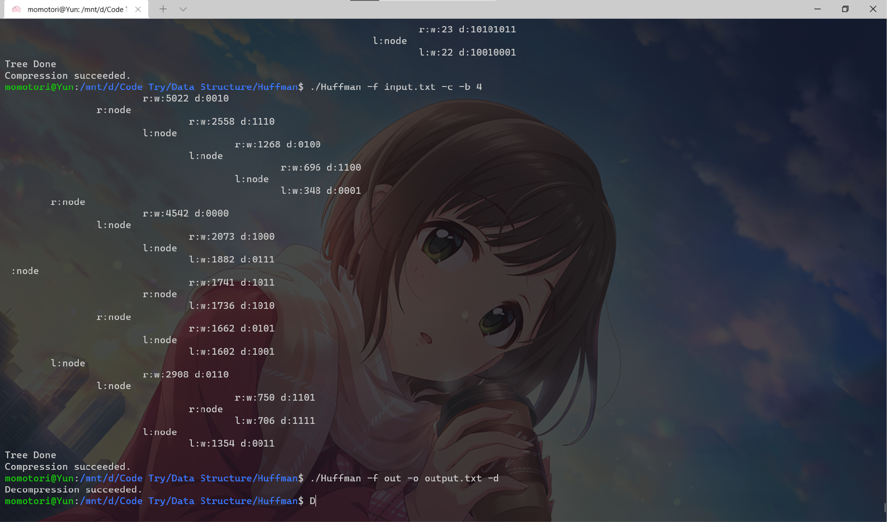

<div align='center' ><font size='6'><b>Huffman压缩报告</b></font></div>


<!-- @import "[TOC]" {cmd="toc" depthFrom=1 depthTo=6 orderedList=false} -->

<!-- code_chunk_output -->

- [实验要求](#实验要求)
- [设计思路](#设计思路)
  - [Compression](#compression)
  - [Decompression](#decompression)
- [关键代码讲解](#关键代码讲解)
  - [main](#main)
  - [头文件Huffman.h](#头文件huffmanh)
  - [Compression](#compression-1)
  - [Decompression](#decompression-1)
- [调试分析](#调试分析)
  - [Compression的时空复杂度](#compression的时空复杂度)
  - [Decompression的时空复杂度](#decompression的时空复杂度)
- [代码测试](#代码测试)
- [实验总结](#实验总结)
- [附录](#附录)

<!-- /code_chunk_output -->


## 实验要求

基于 Huffman 编码实现⼀个压缩器和解压缩器（其中 Huffman 编码以字节作为统计和编码的基本符号
单元），使其可以对任意的⽂件进⾏压缩和解压缩操作。针对编译⽣成的程序，要求压缩和解压缩部分
可以分别独⽴运⾏。具体要求为：
* 每次运⾏程序时，⽤⼾可以指定只压缩/只解压缩指定路径的⽂件。实现的时候不限制与⽤⼾的交
互⽅式，可供参考的⽅式包括但不限于
    * 根据命令⾏参数指定功能（压缩/解压缩）和输⼊/输出⽂件路径
    * GUI 界⾯
    * 运⾏程序后由⽤⼾交互输⼊指定功能和路径
* 【CAUTION!】不被允许的交互⽅式： 通过修改源代码指定功能和⽂件路径
* 压缩时不需要指定解压⽂件的⽬标路径，解压缩时不需要指定压缩前原⽂件的路径，压缩后的⽂件
可以换到另⼀个位置再做解压缩

【实现可指定的任意基本符号单元⼤小的 Huffman 压缩/解压缩算法】 原先我们的 Huffman 编码是对原⽂件的每⼀个字节为基本的符号单位进⾏统计和编码，试修改你的压缩/解压缩器，使其可以指定基本符号单元的⼤小，以 0.5 个字节为其⼤小变化的粒度

当基本符号单元的⼤小不再是字节的时候，可能会出现原⽂件本⾝⼤小并⾮基本符号单元⼤小整数倍的情况，你需要在不改动算法核⼼的前提下解决这个问题，⼀种可能的解决⽅案是将原⽂件填充到合适的⼤小，并通过为压缩⽂件的头部增添额外的信息来让你在解压时可以去掉填充的那部分

## 设计思路

### Compression

根据单元大小iBits，建立$2^{iBits}$个树节点指针

第一次遍历整个文件，每个单元读入后对应的树节点指针若已存在单元则对其权重++，否则建立树节点之后权重++

对树节点指针进行梳理，按照将非空的指针密布至前面，并将空指针排除至建立树节点范围外，记录此时结点数目为$n$，这对于高重复的文档有较好的压缩效果（如英文文档、日文文档等）

利用`std::sort`函数进行降序排序，将最后两个指针合并为新的一个结点，具体算法是将倒数第二个指针移动至第$n$个单元（未被占用的单元）且$n$++，并在移动后空出来的单元建立两个结点合并后的根节点，之后对整个$n-1$单元进行`std::sort`降序排序

如此重复最终可构建出一个Huffman树，将Huffman树的关键信息（子结点，原对应数据）输出至output文件，并第二次读取input文件，输出Huffman树对应的编码

原⽂件本身⼤小并非基本符号单元大小整数倍的情况有特殊处理，对其后面添加0直到达到一个基本单元

最终output文件格式为：iBits,num，填充最后一个单元0的个数，(TreeNode->l,TreeNode->r,TreeNode->data)序列，data，NumberOfFilling.

### Decompression

读取文件头，建立各种关键信息以及Huffman树，再根据输入寻找节点，并将原数据输出到目标文件

之后对尾部进行特殊处理，对应Compression时的处理反处理

## 关键代码讲解

### main

处理命令行输入，有如下几个命令
* -f 后接输入文件
* -o 后接输出文件
* -b 后接压缩的单元bit大小，可以是非4的倍数即非0.5Byte的倍数的单元
* -c 若有这个参数则执行压缩
* -d 若没有"-c"且有"-d"执行解压，若两者都没有则无操作

### 头文件Huffman.h

主要的是树节点的构造，主要参数有左右孩子，权重，该节点对应的原来的单元，以及该节点对应的压缩后对应的01码`s`  
而方法则主要是读取参数与设定参数

```cpp
class TreeNode
{
private:
    Tpointer lchild; //取0
    Tpointer rchild; //取1
    cnt weight;
    Tpointer data; //原压缩文件所对应的基础单元,用整数表示
    string s;
public:
    static int iBits;//存储的原定单元bit个数iBits
    TreeNode()
    {
        lchild = -1;
        rchild = -1;
        weight = 0;
        data = 0;
    }
    TreeNode(Tpointer l,Tpointer r,Tpointer d)
    {
        lchild = l;
        rchild = r;
        data = d;
    }
    cnt W() { return weight; }
    void setW(cnt wt){weight=wt;}
    Tpointer lch() { return lchild; }
    Tpointer rch() { return rchild; }
    Tpointer d() { return data; }
    void setChild(Tpointer l, Tpointer r)
    {
        lchild = l; //0为空，或者是头结点
        rchild = r;
    }
    void operator++() { weight++; }
    void SetData(Tpointer d) { data = d; }
    static void print(TreeNode *list[]); //打印子树
    const string& sout(){return s;}
    void sets(string &sin){s=sin;}
};
```

### Compression

下面是压缩函数，需要注意的是此时主函数已经处理iBits的输出

```cpp
/* 下面是压缩函数 */
/* outfile格式：iBits,num,填充最后一个单元0的个数,
               (TreeNode->l,TreeNode->r,TreeNode->data),
               data,NumberOfFilling. */
void Huffman::Compression(fstream &input, fstream &output)
{
    bool tag = false;
    Tpointer i, j = 0, temp, Maxnum = (1 << (TreeNode::iBits + 1)) - 1;
    Tpointer TPIO;
    TreeNode **list = new TreeNode *[Maxnum];
    Tpointer MaxUnitNum = 1 << (TreeNode::iBits);
    TreeNode **table = new TreeNode *[MaxUnitNum];
    /* 初始化 */
    for (i = 0; i < Maxnum; i++)
        list[i] = NULL;//用于建立Huffman树
    for (i = 0; i < MaxUnitNum; i++)
        table[i] = NULL;//用于Hash表快速查询

    /* 读入并在对应位置权重加一 */
    char c1 = 0, cIO;
    input.read(&c1, sizeof(char));
    while (!tag)
    {
        i = TreeNode::iBits;
        temp = 0;
        while (i > 0)
        {
            temp <<= 1;
            temp += (c1 >> 7) & 0x01;
            c1 <<= 1;
            i--;
            if (j == 7)
            {
                j = 0;
                input.read(&c1, sizeof(char));
                if (tag = input.eof())
                {
                    temp <<= i;
                    break;
                }
            }
            else
                j++;
        }
        if (list[temp])
            ++(*list[temp]); //权加一
        else
        {
            table[temp] = list[temp] = new TreeNode;
            ++(*list[temp]);
        }
    }                        //最后一个单元放temp左边，右边填充0
    Tpointer k = 0, num = 0; //num为除去weight=0后的单元个数.
    cIO = (char)i;
    /* 去除权重为0的单元，以便后面进行排序 */
    while (k < MaxUnitNum)
    {
        if (list[k])
        {
            list[k]->SetData(k);
            TreeNode *ptemp;
            if (k != num)
            {
                list[num] = list[k];
                list[k] = NULL;
            }
            num++;
        }
        k++;
    }
    Tpointer last = num;
    /* 排序，并建立节点关系 */
    while (last > 1)
    {
        sort(list, list + last, compare);
        TreeNode *ptemp;
        list[num] = list[last - 2];
        ptemp = list[last - 2] = new TreeNode;
        ptemp->setChild(last - 1, num);
        ptemp->setW(list[last - 1]->W() + list[num]->W());
        last--;
        num++;
    }
    /* 打印节点，并且将节点对应的压缩后的二进制路径按照
    ASCII的'0'和'1'存入节点的string类型变量s中 */
    TreeNode::print(list);//函数定义在后面
    cout << "Tree Done\n";
    TPIO = num;
    output.write((char *)&TPIO, sizeof(Tpointer));
    output.write(&cIO, sizeof(char));
    i = 0;
    /* 将节点关系输出到输出文件 */
    while (i < num)
    {
        TPIO = list[i]->lch();
        output.write((char *)&TPIO, sizeof(Tpointer));
        TPIO = list[i]->rch();
        output.write((char *)&TPIO, sizeof(Tpointer));
        TPIO = list[i]->d();
        output.write((char *)&TPIO, sizeof(Tpointer));
        i++;
    }
    input.clear();
    input.seekg(0);
    tag = false;
    j = 0;
    c1 = 0;
    char c2 = 0;
    input.read(&c1, sizeof(char));

    int l = 0;
    string s;

    /* 第二次读取输入，并读取节点存储的路径输出 */
    while (!tag)
    {
        i = TreeNode::iBits;
        temp = 0;
        while (i > 0)
        {
            temp <<= 1;
            temp += (c1 >> 7) & 0x01;
            c1 <<= 1;
            i--;
            if (j == 7)
            {
                j = 0;
                input.read(&c1, sizeof(char));
                if (tag = input.eof())
                {
                    temp <<= i;
                    break;
                }
            }
            else
                j++;
        }
        s = table[temp]->sout();
        while (s.length())
        {
            c2 <<= 1;
            c2 += s[0] - '0';
            l++;
            if (l == 8)
            {
                output.write(&c2, sizeof(char));
                c2 = 0;
                l = 0;
            }
            s.erase(s.begin());
        }
    }
    if (l != 0)
    {
        c2 <<= (8 - l);
        output.write(&c2, sizeof(char));
        cIO = 8 - l;
        output.write(&cIO, sizeof(char));
    } //处理结尾的填充个数.
    else
    {
        cIO = l;
        output.write(&cIO, sizeof(char));
    }
    cout << "Compression succeeded." << endl;
}

/* 深搜打印 */
int a;
string sOut;
void DFS(TreeNode *list[], Tpointer i, char c)
{
    Tpointer l = list[i]->lch();
    Tpointer r = list[i]->rch();
    a++;
    if (l != -1)
    {
        sOut = sOut + '1';
        DFS(list, r, 'r');
        sOut.pop_back();
    }
    for (int j = a - 1; j > 0; j--)
        cout << '\t';
    cout << c << ':';
    if (l == -1)
    {
        list[i]->sets(sOut);
        cout << "w:" << list[i]->W() << " d:" << Int2cBit(list[i]->d()) << endl;
    }
    else
        cout << "node" << endl;
    if (l != -1)
    {
        sOut = sOut + '0';
        DFS(list, l, 'l');
        sOut.pop_back();
    }
    a--;
}

void TreeNode::print(TreeNode *list[])
{
    a = 0;
    DFS(list, 0, ' ');
}

```

### Decompression

下面是解压函数，需要注意的是此时主函数已经处理iBits的输入

```cpp
/* 解压函数 */
void Huffman::DeCompression(fstream &input, fstream &output)
{
    Tpointer num, i = 0, l, r, data;
    int j, m;
    Tpointer k;
    bool tag = false; //文件读取结束的tag

    /* 读取文件头，建立各种关键信息以及Huffman树 */
    input.read((char *)&num, sizeof(Tpointer));
    char ct;
    input.read(&ct, sizeof(char));
    TreeNode **list = new TreeNode *[num];
    while (i < num)
    {
        input.read((char *)&l, sizeof(Tpointer));
        input.read((char *)&r, sizeof(Tpointer));
        input.read((char *)&data, sizeof(Tpointer));
        list[i] = new TreeNode(l, r, data);
        i++;
    }
    char c1, c2, c3, co = c3 = c2 = c1 = 0;
    input.read(&c1, sizeof(char));
    input.read(&c2, sizeof(char));
    input.read(&c3, sizeof(char));
    TreeNode *pTemp;
    tag = input.eof();
    j = m = 0;
    k = 0;
    pTemp = list[0];
    l = pTemp->lch();
    r = pTemp->rch();

    /* 根据输入寻找节点，并将原数据输出到目标文件 */
    while (!tag)
    {
        while (j < 8)
        {
            pTemp = (c1 < 0) ? list[r] : list[l];
            c1 <<= 1;
            j++;
            l = pTemp->lch();
            r = pTemp->rch();
            if (l == -1)
            {
                k = (1 << (TreeNode::iBits - 1));
                data = pTemp->d();
                while (k != 0)
                {
                    co <<= 1;
                    co = (data & k) ? co + 1 : co;
                    m++;
                    if (m == 8)
                    {
                        output.write(&co, sizeof(char));
                        m = 0;
                    }
                    k >>= 1;
                }
                pTemp = list[0];
                l = pTemp->lch();
                r = pTemp->rch();
            }
        }
        c1 = c2;
        c2 = c3;
        j = 0;
        input.read(&c3, sizeof(char));
        tag = input.eof();
    }

    /* 对尾部的特殊处理 */
    j = 8 - (int)c2;
    while (j > 0)
    {
        pTemp = (c1 < 0) ? list[r] : list[l];
        c1 <<= 1;
        j--;
        l = pTemp->lch();
        r = pTemp->rch();
        if (l == -1)
        {
            k = (1 << (TreeNode::iBits - 1));
            data = pTemp->d();
            Tpointer judge = (j == 0) ? ((ct) ? (1 << (ct - 1)) : 0) : 0;
            while (k != judge)
            {
                co <<= 1;
                co = (data & k) ? co + 1 : co;
                m++;
                if (m == 8)
                {
                    output.write(&co, sizeof(char));
                    m = 0;
                }
                k >>= 1;
            }
            pTemp = list[0];
            l = pTemp->lch();
            r = pTemp->rch();
        }
    }
    cout << "Decompression succeeded." << endl;
}
```

## 调试分析

### Compression的时空复杂度

先从空间复杂度开始，压缩的空间复杂度取决于单元大小`iBits`，为$O(2^{iBits})$

时间复杂度按照算法过程逐渐分析：  
不妨设$b=2^{iBits}$

* 读入文件并使对应单元权加一：  
$O(n)$，n为文件长度
* 去除权重为0的单元：  
$O(b)$
* 排序，并建立节点关系：  
$O(num^2\log{num})$，其中num为存在的结点个数，在大部分情况下$\approx O(b^2\log{b})$
* 打印节点，并且将节点对应的压缩后的二进制路径存入节点：  
最坏情况为$O(b)$
* 将节点关系输出到输出文件：  
最坏情况为$O(b)$
* 第二次读取输入，并读取节点存储的路径输出：  
$O(n)$

故总时间复杂度为$O(n+b^2\log{b})=O(n+iBits\times2^{2iBits})$  
随着单元大小指数增大，故较小的单元有利于较快的运行速度

### Decompression的时空复杂度

同样先从空间复杂度开始，压缩的空间复杂度输入文件的头文件所取决的`num`，大部分情况下为$O(2^{iBits})=O(b)$

时间复杂度按照算法过程逐渐分析：

* 读取文件头，建立各种关键信息以及Huffman树：  
$O(num)$，大部分情况是$O(b)$
* 根据输入寻找节点，并将原数据输出到目标文件：  
$O(n)$

故总时间复杂度为$O(n+b)=O(n+2^{iBits})$ 

## 代码测试

首先是11bit为基本单元的压缩，以当前markdown文本存入txt文件为input文件，接下来两张图为压缩指令与部分huffman树展示以及解压指令




下面是解压后文件展示，与原文件完全相同



以一个较小bit的4bits作为打印Huffman树的展示



## 实验总结

一开始决定树节点结构花费了不少时间，在使用指针和使用数组作为指向子节点的元素两种选择上纠结了很久，但考虑到能够使用Hash表快速查询与能够方便地进行排序而选择使用数组的结构

在决定了数据结构后算法的部分是比较轻松的，但在原⽂件本⾝⼤小并⾮基本符号单元⼤小整数倍的情况的调试稍微出了一点麻烦，但在想通之后debug就比较轻松，再加上有hex编辑器能够方便地查看out文件的十六进制表示，可以很快地debug成功

## 附录
.  
├── Huffman.cpp：实现代码  
├── Huffman.h：头文件声明  
├── Makefile：Makefile  
└── main.cpp：主函数
